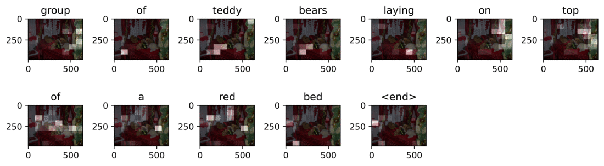

# Image-Captioning-With-Attention
Tensorflow implementation of attention mechanisms for image captioning

<p align="center">
  <br><br>
  <br>
  <!--b>This is the look of the Live Visualizer</b!-->
  <!--br><br><br><br><br><br>
  <br>
  <b>This shows the filtering of rostopics in the graph</b!-->
</p>

## Access H-BRS cluster

Open a terminal to access the cluster

```
ssh user2s@wr0.wr.inf.h-brs.de

```

user2s is your own student identifier. After that type your cluster password and you'll be logged on to the cluser.

## Install Anaconda in H-BRS cluster

Now create a temporal directory to store the anaconda installation file. In your cluster home directory do 

```
mkdir temporal

```

Then proceed with the Anaconda installation in your cluster account. [Install Anaconda in Ubuntu](https://www.digitalocean.com/community/tutorials/how-to-install-anaconda-on-ubuntu-18-04-quickstart).

## Install dependencies

Once Anaconda has been installed in your cluster account, create an anaconda environment (in this case we are naming the environment NLP to exemplify)

```
conda create -n NLP python=3.6
```

Activate the environment and proceed to install the packages listed in the ```requirements.txt``` file. As of now you have to install one by one manually using the conda install command. Make sure to install **tensorflow-gpu** in order to access the GPU card from the cluster.


## Copy python scripts to H-BRS cluster

In your cluster home folder, create a main directory to store the python scripts

```
mkdir image_captioning

```

In terminal type the following

```
scp /home/hackerman/Documents/Alan-Git-Repositories/Natural-Language-Processing/Project/model.py apreci2s@wr0.wr.inf.h-brs.de:/home/apreci2s/Image_captioning

```

In the above line I have copied the script ```main.py``` from my local PC into my cluster folder. **Make sure to provide the correct path to the script in your local PC**.

You have to copy the rest of the scripts similarly. The **cluster_transfer_data.txt** has the command line instructions to do it.

## Run job in H-BRS cluster

Create a jobs folder in your cluster home directory

```
mkdir jobs

```

This folder will contain the sh file that will execute the job in the cluster.

Create in this folder an .sh file using the vim command

```
vim image_caption.sh
```

This will open the vim editor, inside of this editor, write the following bash script

```
#!/bin/bash
#SBATCH --job-name=image_caption.sh
#SBATCH --partition=gpu
#SBATCH --nodes=1
#SBATCH --mem=120GB
#SBTACH --ntasks-per-node=16
#SBATCH --time=72:00:00
#SBATCH --output job_image_caption.out
#SBATCH --error job_image_caption.err

source ~/anaconda3/bin/activate ~/anaconda3/envs/NLP

module load cuda

cd /home/user2s/image_captioning

python main.py

```

The above is setting the gpu partition, activating the ```NLP``` Anaconda environment and running the ```main.py``` script. We have added the ```.sh``` file in this repository as well in case you want to transfer it directly via ```scp``` to the cluster. Make sure to edit your username in the line ```cd /home/user2s/image_captioning```


**NOTE:** If it is the first time you run the program, make sure to add the following argument to the bash script: ```python main.py --cache_inception_features True```

This will tell the program to compute image features using a pre-trained InceptionV3 model from tensorflow. These image features are necessary since they're the input to the decoder together with captions. 

At this point everything is ready to run the program by submitting a job in the cluster. Before this, you can modify some of the main parameters of the program, these are found in the ```main.py``` script

* EPOCHS
* BATCH_SIZE
* top_k (top words in the vocabulary)
* num_examples (number of captions and images to train the neural network)

The above parameters are set by default to run a job that takes around 10 minutes. 

Submit the job doing 

```
sbatch image_caption.sh
```

You can monitor the progress of training by opening the ```job_image_caption.err``` and ```job_image_caption.out``` files. 

## Training model

This implementation is closely related to the tensorflow tutorial for [image captioning](https://github.com/tensorflow/docs/blob/master/site/en/tutorials/text/image_captioning.ipynb). 

This repository extends the tutorial by having separate script modules, this helps keeping a more maintainable and organized implementation. The neural network model implemented here is based on the [Show, attend and tell paper](https://arxiv.org/abs/1502.03044) by Bengio et. al (2015).

The general procedure for data processing and training is as follows:

 * test 


## Retrieve results and model parameters from cluster to local PC
